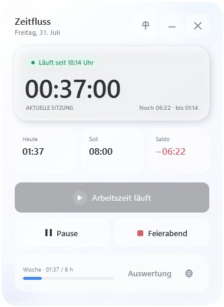
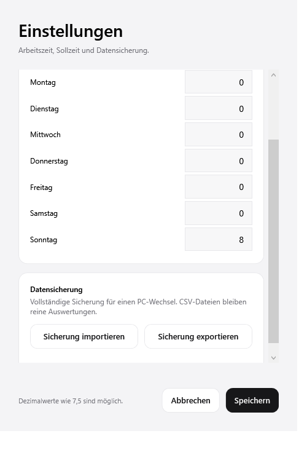
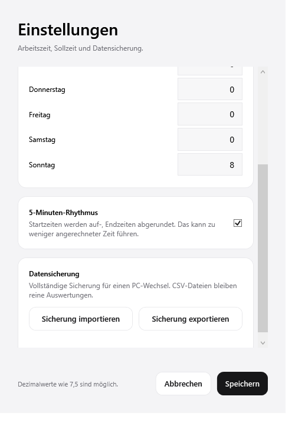
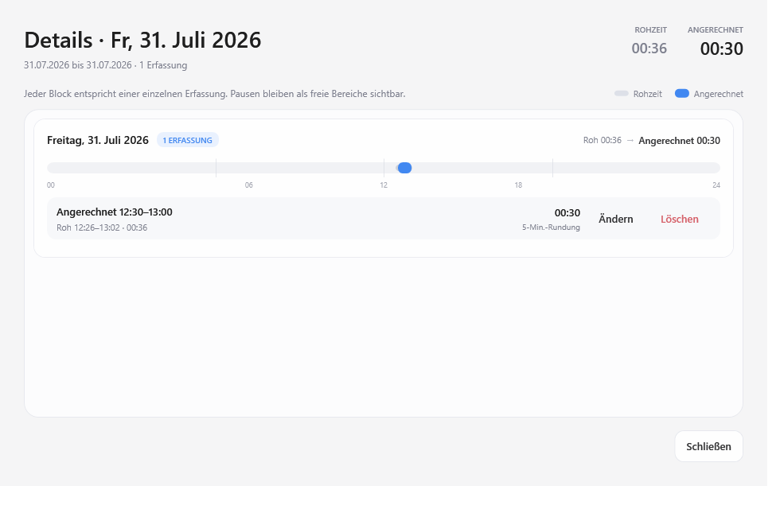

# Zeitfluss

Zeitfluss ist eine kleine, lokale Arbeitszeiterfassung für Windows auf Basis von .NET 10 und WPF.

Zeitfluss ist unter der [MIT-Lizenz](LICENSE) veröffentlicht. Für zukünftige Windows-Releases ist die Code-Signierung über die [SignPath Foundation](https://signpath.org/) vorgesehen.

## Funktionen

- Mehrere Arbeitsintervalle pro Tag mit **Arbeit beginnen**, **Pause/Fortsetzen** und **Feierabend**
- Regelarbeitszeit für Montag bis Sonntag und validierte Gesamtwochenstunden
- Fortlaufender Zeitsaldo über Tage, Kalenderwochen, Monate und Jahre
- Statistikansicht nach Tagen, Wochen, Monaten und Jahren mit Soll, Ist, Periodendifferenz und übertragenem Gesamtsaldo
- Excel-kompatibler CSV-Export mit deutschem Semikolon-Format
- Frei verschiebbares Hauptfenster und ein 238 × 54 Pixel großer, transparent gerenderter Kompaktmodus
- Kompaktanzeige mit heutiger Gesamtarbeitszeit und grünem Statuspunkt bei laufender Erfassung
- Kompaktanzeige per Ziehen frei verschiebbar, mit direkten Schaltflächen für Pause und Feierabend; ihre Position wird separat gespeichert
- Optionaler 5-Minuten-Rhythmus: Beginn wird auf-, Ende abgerundet; die Rohzeit bleibt in den Details sichtbar. Beispiele: Start um 12:28 zählt ab 12:30, Start um 12:32 ab 12:35, Ende um 12:32 bis 12:30.
- Details je Tages-, Wochen-, Monats- oder Jahresperiode mit allen einzelnen Arbeitsintervallen
- Nachträgliches Korrigieren und Löschen einzelner Arbeitsintervalle mit Schutz vor Überschneidungen und Zukunftszeiten
- Verlustfreie `.zeitfluss`-Datensicherung für Import und Export beim PC-Wechsel
- Lokale, atomar gespeicherte JSON-Daten ohne Cloud oder Benutzerkonto

## Starten

Zeitfluss kann als self-contained Single-File-EXE veröffentlicht werden und benötigt dann keine separate .NET-Installation:

```powershell
dotnet publish Zeitfluss\Zeitfluss.csproj -c Release -r win-x64 --self-contained true -p:PublishSingleFile=true -o publish
```

Die fertige Anwendung liegt anschließend unter `publish/Zeitfluss.exe`.

Beim ersten Start beginnt die Saldoberechnung am aktuellen Tag. Die Daten werden unter `%LOCALAPPDATA%\Zeitfluss\arbeitszeiten.json` gespeichert. Ein offenes Arbeitsintervall bleibt auch nach einem Neustart erhalten.

## Bedienung

1. Über das Zahnrad Wochenstunden und Tagessollzeiten einstellen. Die Summe der sieben Tage muss den Wochenstunden entsprechen.
2. **Arbeit beginnen** startet ein Intervall.
3. **Pause** beendet das aktuelle Intervall; **Arbeit fortsetzen** beginnt ein weiteres.
4. **Feierabend** schließt das aktuelle Intervall und markiert den Tag als beendet. Bei Bedarf kann danach nochmals gestartet werden.
5. Über das Minus oben rechts wird Zeitfluss zum kleinen Zeitindikator. Der linke Bereich lässt sich verschieben oder anklicken; die beiden Schaltflächen pausieren beziehungsweise beenden die Zeiterfassung direkt.
6. Unter **Auswertung** zwischen Tagen, Wochen, Monaten und Jahren wechseln oder alle Tagesdaten als CSV exportieren. Über **Details → Ändern** lassen sich Beginn und Ende eines Eintrags sekundengenau korrigieren; mit **×** kann er gelöscht werden.
7. Unter **Einstellungen → Datensicherung** lässt sich der vollständige Bestand als `.zeitfluss`-Datei exportieren und auf einem anderen PC importieren. Vor einem Import erstellt die App automatisch eine Vor-Import-Sicherung in `%LOCALAPPDATA%\Zeitfluss`.
8. Unter **Einstellungen → 5-Minuten-Rhythmus** kann die Rundung für künftig gestartete Arbeitsphasen aktiviert werden. Details zeigen stets die angerechnete und die Rohzeit.

CSV-Dateien sind für Excel und Auswertungen gedacht. Für eine vollständige Wiederherstellung müssen `.zeitfluss`-Sicherungen verwendet werden. Vor einem Sicherungsexport muss eine laufende Arbeitszeit pausiert werden.

## Entwickeln und prüfen

```powershell
dotnet build Zeitfluss\Zeitfluss.csproj -c Release
dotnet run --project Zeitfluss.LogicTests\Zeitfluss.LogicTests.csproj -c Release
dotnet run --project Zeitfluss.VisualSmoke\Zeitfluss.VisualSmoke.csproj -c Release -- visual-smoke
dotnet publish Zeitfluss\Zeitfluss.csproj -c Release -r win-x64 --self-contained true -p:PublishSingleFile=true -o publish
```

Die Render-Smoke-Tests prüfen aktive, pausierte, beendete und kompakte Zustände, die Korrekturmaske sowie die Tagesauswertung. Der Zielordner wird beim Aufruf als letztes Argument angegeben.

## Screenshots








