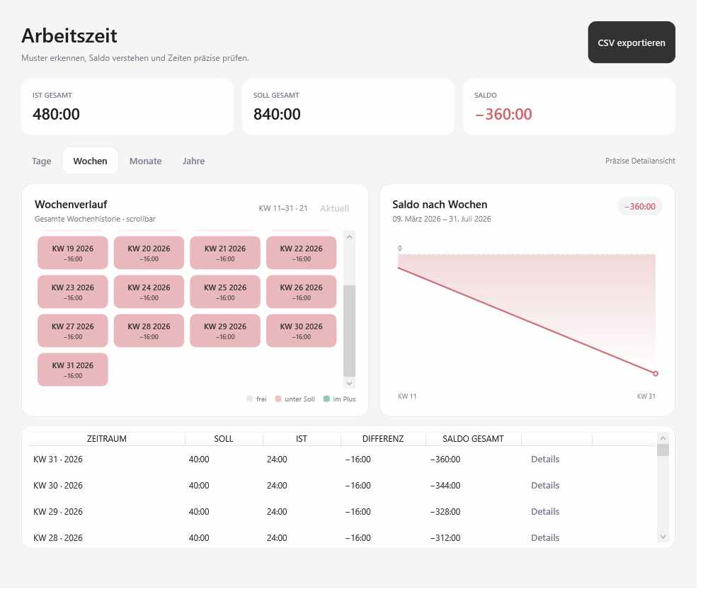
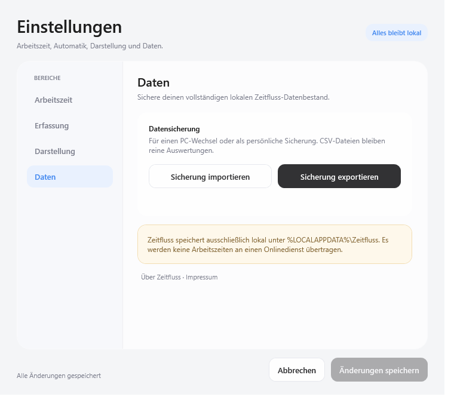

# Zeitfluss

**Arbeitszeit erfassen, Saldo verstehen, Daten selbst behalten.**

[](https://github.com/baschti85/Zeitfluss/releases/latest/download/Zeitfluss.exe)
[](https://github.com/baschti85/Zeitfluss/releases/latest)
[](https://dotnet.microsoft.com/)
[](LICENSE)

Zeitfluss ist eine minimalistische, lokale Arbeitszeiterfassung für Windows. Die App kombiniert mehrere Erfassungen pro Tag, ein fortlaufendes Zeitkonto und präzise Detailansichten mit einer ruhigen, glasartigen Oberfläche. Sie läuft als einzelne EXE – ohne Konto, Cloud oder separate .NET-Installation.

<p align="center">
  
</p>

## Download

**[Zeitfluss.exe herunterladen](https://github.com/baschti85/Zeitfluss/releases/latest/download/Zeitfluss.exe)**

- Windows 10 oder 11, 64 Bit
- Self-contained Single-File-EXE
- Keine Installation erforderlich
- Arbeitszeitdaten bleiben ausschließlich auf dem eigenen PC

> Die öffentliche Code-Signierung über die SignPath Foundation ist vorbereitet, aber noch nicht freigeschaltet. Bis dahin sind Release-Dateien nicht Authenticode-signiert. Veröffentlichte Dateien stammen reproduzierbar aus diesem Repository.

## Was Zeitfluss besonders macht

### Erfassen ohne Reibung

- Beliebig viele Arbeitsintervalle pro Tag
- **Arbeit beginnen**, **Pause/Fortsetzen** und **Feierabend**
- Live-Timer, Tagessoll, Restzeit und voraussichtlicher Feierabend
- Verschiebbare Mini-Bubble mit Tageszeit sowie Pause/Play und Stopp
- Tray-Steuerung und optionale globale Tastenkürzel
- Dezente Erinnerung beim Erreichen des Tagesziels

### Zeitkonto, das wirklich mitdenkt

- Regelarbeitszeit für Montag bis Sonntag und konfigurierbare Wochenstunden
- Fortlaufender Saldo mit Übertrag von Guthaben und Minusstunden
- Dynamische Auswertung nach **Tagen, Wochen, Monaten und Jahren**
- Vollständige, scrollbar dargestellte Historie statt eines festen Sechs-Wochen-Ausschnitts
- Synchronisierte Saldokurve, Periodentabelle und direkter Detail-Drilldown

### Präzise und korrigierbar

- Einzelne Erfassungen mit Beginn, Ende, Dauer und Tageszeitleiste
- Zeiten nachträglich ändern oder löschen, inklusive Überschneidungsprüfung und Rückgängig-Funktion
- Intelligente Korrekturvorschläge für vergessene oder ungewöhnlich lange Timer
- Optionaler Fünf-Minuten-Rhythmus: Start immer zur nächsten, Ende zur vorherigen Fünf-Minuten-Grenze
- Rohzeit und angerechnete Zeit bleiben in den Details nachvollziehbar

### Lokal, portabel und unter deiner Kontrolle

- Atomare lokale Speicherung unter `%LOCALAPPDATA%\Zeitfluss`
- Verlustfreier Export und Import als `.zeitfluss`-Sicherung
- Excel-kompatibler CSV-Export
- Keine Telemetrie, kein Benutzerkonto, kein Clouddienst
- Einstellbare Glas-Deckkraft für alle Fenster

## Einblicke

<table>
  <tr>
    <td width="50%"><br><sub>Kompakt, verschiebbar und direkt steuerbar</sub></td>
    <td width="50%"><br><sub>Vollständige, dynamische Periodenhistorie</sub></td>
  </tr>
  <tr>
    <td width="50%"><br><sub>Präzise Details und Korrekturen</sub></td>
    <td width="50%"><br><sub>Import, Export und klare Datenschutzinformation</sub></td>
  </tr>
</table>

## Erste Schritte

1. `Zeitfluss.exe` aus dem [neuesten Release](https://github.com/baschti85/Zeitfluss/releases/latest) herunterladen und starten.
2. Über das Zahnrad Wochenstunden und Tagessollzeiten festlegen. Die Summe der sieben Tage muss den Wochenstunden entsprechen.
3. **Arbeit beginnen** wählen. Eine Pause schließt das laufende Intervall; **Fortsetzen** öffnet ein neues.
4. Unter **Auswertung** den gewünschten Zeitraum wählen. Verlauf, Saldokurve und Tabelle wechseln gemeinsam.
5. Über **Details** einzelne Erfassungen prüfen, ändern oder löschen.

Beim ersten Start beginnt die Saldoberechnung am aktuellen Tag. Ein laufendes Intervall bleibt auch nach einem Neustart erhalten.

## Rundung im Fünf-Minuten-Rhythmus

Die Option wirkt nur auf neu gestartete Erfassungen und kann bewusst zu einem Zeitverlust führen:

| Aktion | Tatsächliche Uhrzeit | Angerechnete Uhrzeit |
|---|---:|---:|
| Start | 12:28 | 12:30 |
| Start | 12:32 | 12:35 |
| Ende | 12:32 | 12:30 |
| Ende | 12:27 | 12:25 |

## Sicherung und Export

- **CSV** ist für Excel und weitere Auswertungen gedacht.
- **`.zeitfluss`** enthält den vollständigen Datenbestand und ist für PC-Wechsel oder Wiederherstellungen vorgesehen.
- Vor jedem Import erstellt Zeitfluss automatisch eine lokale Vor-Import-Sicherung.
- Für eine vollständige Sicherung muss eine laufende Erfassung zuerst pausiert werden.

## Tastenkürzel

Globale Kürzel sind optional und in den Einstellungen konfigurierbar:

| Taste | Aktion |
|---|---|
| `F8` | Arbeit beginnen |
| `F9` | Pause oder Fortsetzen |
| `F10` | Feierabend |

Eine wählbare Zusatztaste verhindert Konflikte mit anderen Programmen.

## Selbst bauen und prüfen

Voraussetzung ist das .NET 10 SDK unter Windows.

```powershell
dotnet build Zeitfluss.slnx -c Release
dotnet run --project Zeitfluss.LogicTests\Zeitfluss.LogicTests.csproj -c Release
dotnet run --project Zeitfluss.VisualSmoke\Zeitfluss.VisualSmoke.csproj -c Release -- visual-smoke
dotnet publish Zeitfluss\Zeitfluss.csproj -c Release -r win-x64 --self-contained true -p:PublishSingleFile=true -p:EnableCompressionInSingleFile=true -p:DebugType=None -p:DebugSymbols=false -o publish
```

Die Logiktests prüfen Zeitberechnung, Saldo, Rundung, Sicherungen und Wiederherstellung. Der visuelle Smoke-Test rendert alle Hauptzustände, Dialoge, dynamischen Statistikmodi und Mindestgrößen.

## Datenschutz und Sicherheit

Zeitfluss überträgt keine Arbeitszeitdaten. Alle Nutzdaten liegen unter `%LOCALAPPDATA%\Zeitfluss` und können über die integrierte Sicherung selbst verwaltet werden. Sicherheitsrelevante Hinweise können über [GitHub Issues](https://github.com/baschti85/Zeitfluss/issues) oder per E-Mail gemeldet werden.

## Impressum

**Bastian Werner**<br>
BAIUDBw TM 1<br>
[bastianwerner@bundeswehr.org](mailto:bastianwerner@bundeswehr.org)<br>
[github.com/baschti85/Zeitfluss](https://github.com/baschti85/Zeitfluss)

Das Impressum ist auch in der App unter **Einstellungen → Daten → Über Zeitfluss · Impressum** hinterlegt.

## Lizenz

Zeitfluss ist unter der [MIT-Lizenz](LICENSE) veröffentlicht.
